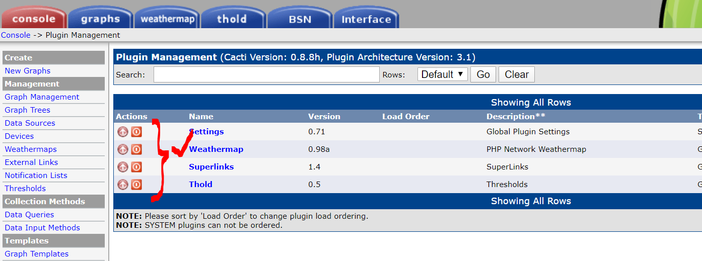

# cacti


Collection of scripts and information regarding the installation of cacti version `cacti-0.8.8h`. I use this older version becasue I'm very fond of the weathermap plugin which I believe provides the easiest way to see traffic patterns in your environment. At the time of this document, weathermap is not easily installed with cacti version >= 1.0. This may have changed but generally most of the functionality that I like to use is in pre 1.0 versions.

```
.
├── cacti-0.8.8h.tar.gz
├── cacti-backup.sh
├── cacti-install.sh
├── cacti-restore.sh
├── cacti-spine-0.8.8h.tar.gz
├── images
├── network-weathermap-version-0.98a.tar.gz
├── README.md
├── settings-v0.71-1.tgz
├── superlinks-v1.4-2.tgz
└── thold-v0.5.0.tgz
```

## Installation

- Step 1: clone this repository into /opt/cacti (if you need to install this somewhere else update all the scripts to reflect your environment.)
- Step 2: run `cacti-install.sh` and hope there are no errors :)
- Step 3: point your web browser at your service and then login as admin/admin (default account)
- Step 4: enable spine poller

- Step 5: enable the plugins you'd like


## Backup

The backup script `cacti-backup.sh` is executed by cron and scheduled during the install script. It will save a tarball of the mysql DB and all the files need to restore the cacti on another system.

## Restore

The restore script `cacti-restore.sh` using the backup tarball to restore cacti. The steps are:

- Step 1: start your destination system hopefully using the same OS as the source
- Step 2: on the destination system create directory `/opt/cacti`
- Step 3: copy the tarball `cacti-backup-package.tgz` from the source to the destination system into `/opt/cacti`
- Step 4: untar `cacti-backup-package.tgz`
- Step 5: run `cacti-backup.sh` and select the backup DOW file (1-7 - you can find the available backups in the `/opt/cacti/backup` directory
- Step 6: `cacti-backup.sh` will then ask for your mysql DB password. This should be the same password as the source cacti mysql instance
- Step 7: once the script is done, login using your credentials from the source cacti